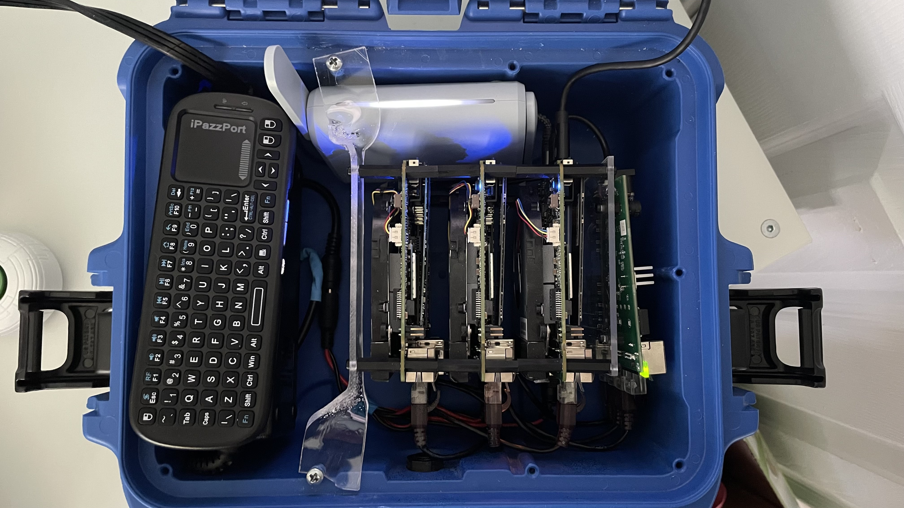

# Tactical Edge Reference Architecture

Rancher Federal field engineers get asked all the time about how to deploy at the edge. If we google "edge computing" we will get roughly 301,000,000 results that all same something different. Let use help define what the Tactical Edge is and how to leverage Kubernetes. The goal is increasing speed while decreasing complexity.

> **Table of Contents**:
>
> * [What is the Tactical Edge](#What_is_the_Tactical_Edge)

## What is the Tactical Edge

There is an interesting article from Software Engineering Institute and Carnegie Mellon University about [Cloud Computing at the Tactical Edge](https://resources.sei.cmu.edu/library/asset-view.cfm?assetid=28021). What is interesting is to see the need for "Tactical Edge" computing 10 years ago. The need for getting applications in the hands of the war fighter or first responder is incredible valuable. From the abstract:

>Handheld mobile technology is reaching first responders, disaster-relief workers, and soldiers in the field to aid in various tasks, such as speech and image recognition, natural-language processing, decision making, and mission planning.

Let's fast forward 10 years and it is amazing to see the amount of compute that can fit inside a coffee can. Case in point ASROCK Industrial has a [very powerful](https://www.asrockind.com/en-gb/4X4%20BOX-5800U) computer in package that is 4 inches by 4 inches by 2 inches. Not only is it tiny, but the power consumption is low enough to run on batteries for some time. Compute had gotten powerful enough and small enough to run big applications in the palm of your hand.

### Problem with Tactical Edge

## Hardware

## OS

## Software

### Internal Registry

### RKE2

### Longhorn

### Rancher

