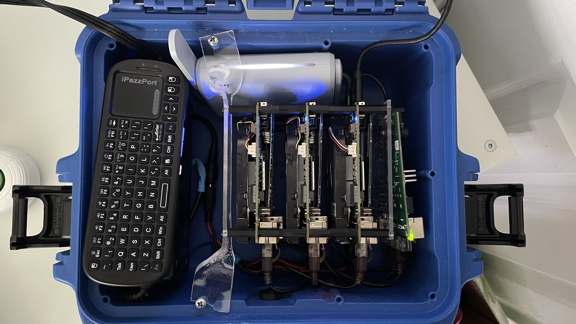
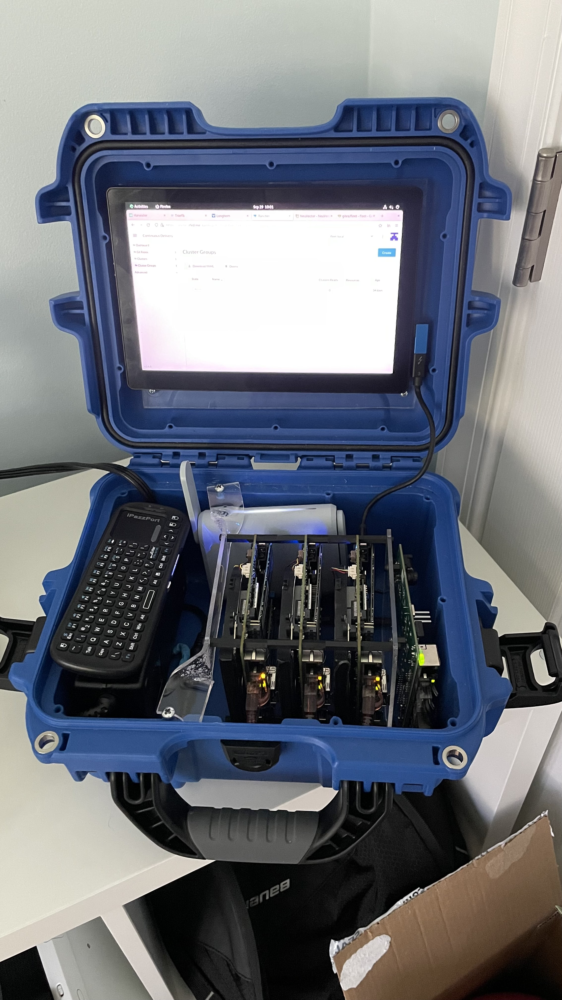
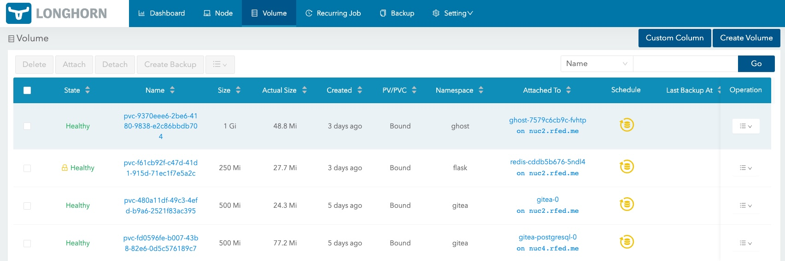

# Tactical Edge Reference Architecture

Rancher Federal field engineers get asked all the time about how to deploy at the edge. If we google "edge computing" we will get roughly 301,000,000 results that all same something different. Let use help define what the Tactical Edge is and how to leverage Kubernetes. The goal is increasing speed while decreasing complexity.

> **Table of Contents**:
>
> * [What is the Tactical Edge](#what_is_the_tactical_edge)
>   * [Difficulties with Tactical Edge](#Difficulties_with_Tactical_Edge)
> * [Hardware](#Hardware)
> * [Operating System](#Operating_System)
> * [Software](#Software)
>   * [RKE2](#RKE2)
>   * [Longhorn](#Longhorn)
>   * [Rancher](#Rancher)
> * [Next Level](#Next_Level)
>   * [Harvester](#Harvester)
>   * [Gitea](#Gitea)
>   * [Registry](#Registry)
> * [Conclusion](#conclusion)

## What is the Tactical Edge

There is an interesting article from Software Engineering Institute and Carnegie Mellon University about [Cloud Computing at the Tactical Edge](https://resources.sei.cmu.edu/library/asset-view.cfm?assetid=28021), from 2012. What is interesting is to see the need for "Tactical Edge" computing 10 years ago. The need for getting applications in the hands of the war fighter or first responder is incredibly valuable. From the abstract:

>Handheld mobile technology is reaching first responders, disaster-relief workers, and soldiers in the field to aid in various tasks, such as speech and image recognition, natural-language processing, decision making, and mission planning.

Let's fast forward 10 years and it is amazing to see the amount of compute that can fit inside a coffee can. Case in point ASROCK Industrial has a very powerful [4X4 BOX-5800U](https://www.asrockind.com/en-gb/4X4%20BOX-5800U) computer in a package that is 4 inches by 4 inches by 2 inches. Not only is it tiny, but the power consumption is low enough to run on batteries for some time. Compute had gotten powerful enough and small enough to run big applications in the palm of your hand.

We are defining Tactical Edge as: A small case/kit that contains compute that is easily portable. The number and size of the nodes can vary. Being portable is a key characteristic.

Using this definition we can start to think about real world applications of such a cluster/box/backpack. The technique of "Moving Computation to Where the Data Lives" can be applied. In a lot of the use cases we have seen the organization wants to process data in the field. Then distill it into more meaningful data to be sent back to upstream. Now for some down sides of computing at the Tactical Edge.

### Difficulties with Tactical Edge

There are two major difficulties for computing at the Tactical Edge. The first one being power space and cool. This is difficulty for even the biggest data centers around the world. When looking for hardware pay some attention to the [Thermal Design Power](https://en.wikipedia.org/wiki/Thermal_design_power) or TDP for short. This will indicate how much power is required for that device. Remember that the power requirements will increase when the device is under heavy load.

The second major difficulty is manageability. How are we going to manage the Operating System and Applications far away from "home". There is where we can leverage Kubernetes and GitOps techniques to dramatically increase the velocity of deployment and manageability. We will walk through some of the choices further in this article.

Now that we have defined a few major difficulties we can start looking at the what a Tactical Edge Architecture would look like.

## Hardware

Boy do we have many choices on hardware these days. X86 or Arm? Intel or AMD? My favorite approach for picking hardware is to look at the applications that are needed. We call this approach "working backwards". Once the total amount of compute required is calculated we can start looking at the amount of CPU that will be needed. Adding the appliction CPU and Memory together with the Kubernetes and management overhead we get the "Compute Envelope". Meaning the total amount of CPU cores and Memory. There are other components, like networking, that are worth looking at.

For this reference architecture we have chosen three [ASROCK 4X4 BOX-5800U](https://www.asrockind.com/en-gb/4X4%20BOX-5800U) boards. There is a good balance of cores, memory, storage and TDP. Each board has 8 cores and support up to 64gb of ram. For storage there is NVME (PCIe Gen3x4) support and a SATA3 port. As for power, we were able to use a single 150w power supply for all three boards. Each board has a TDP of 60Watts. Under heavy load there were no issues at all. The boards also have multiple NICs, including a 2.5gb one.

To maximize the portability we added a [Gl.inet Beryl Travel Route](https://www.gl-inet.com/products/gl-mt1300/). The router is great for extending the connectivity to additional devices like a laptop. The router also has a "repeater" function for Wifi. Meaning all the nodes and reach the internet for updating and initial loading of software. And of course an internal DHCP server. As a side note, some of the Gl.iNet routes also have WireGuard (VPN) capabilities.

One last piece to this architecture is a [Netgear GS105](https://www.netgear.com/business/wired/switches/unmanaged/gs105/) five port 1 Gigabit ethernet switch. The switch provides communication between the nodes. The switch could easily be upgraded to 2.5 Gigabit if needed. Also, if the cae only had two nodes the GL.iNet router would be able to handle all the internal traffic.

## Operating System

Similar to how much choice there is in the hardware realm, we have similar choice when it comes to operating systems. Being honest, there are two front runners. Both will work with 99.99% of the hardware that will be through at it. [Ubuntu](https://ubuntu.com/) is a great choice for many. It is built on Debian which has been around for decades. [Rocky Linux](https://rockylinux.org/) is the second choice. Rocky is the new Centos. Rocky is built from RHEL with all the enterprise security and stability built in. We have a few guides that talk about using Rocky as a secure foundation for RKE2. For this guide, Rocky for the win! And yes, please leave SElinux enforcing.

As for installation method. We are going to leave that up to you. If you have PXE infrastructure in place, use it. For cluster in the pictures we used a usb-c thumb drive.

## Software

Since we are leveraging Kubernetes we are going to use some of the tools in the Rancher portfolio. Namely [RKE2](https://docs.rke2.io/) for the Kubernetes layer. Next [Longhorn](https://longhorn.io/) for stateful storage across the nodes. And not least, [Rancher](https://docs.ranchermanager.rancher.io/) for managing everything. For all the installs we are need to follow the air-gap instructions. The down side of the Tactical Edge is that you have to assume there is no network communication with the outside world.

### RKE2

What is RKE2 you ask? It is a fully conformant Kubernetes distribution that focuses on security and compliance within the U.S. Federal Government sector. Meaning it has FIPS, SELlinux, STIGs, compliance and security support at it's foundation. Another great reason to choose RKE2 for your Kubernetes layers is that air-gapping the software is not an afterthought. In fact all of Rancher's products have air-gap install instructions. For the sake of this guide we will skip providing the code. Please review the air-gap install [docs for RKE2](https://docs.rke2.io/install/airgap/). The basic procedure for installing air-gapped is to get the tarball that contains all the bits.

It is also worth mentioning we have another article on apply the STIG and security best practices for RKE2 and Rancher on [Intelligence Community News](https://intelligencecommunitynews.com/ic-insiders-have-you-stigd-your-kubernetes-yet/).

### Longhorn

For those uninitiated, Longhorn is Rancher's storage product. Longhorn creates a highly available, encrypted at rest if enabled, storage layer using the aggregate storage already on the nodes. This is a fantastic way to create storage for stateful applications without having to add additional hardware.

Similar to RKE2, Longhorn had [very good documentation](https://longhorn.io/docs/1.3.1/advanced-resources/deploy/airgap/) for installing across the air-gap. Longhorn and Rancher will use a similar model of moving container images and Helm charts. For this reason it might make sense to stand up a registry inside the kit.

### Rancher

Now let's look at multi-cluster management layer known as Rancher. Rancher is a fantastic way to create a single pane of glass to manage all the applications in the kit. Rancher will be able to manage the application life cycles through a variety of methods, including GitOps. Adding version control within the kit will help facilitate GitOps. Rancher's primary method for installing is Helm. In order to install air-gapped the charts will also need to be moved across with the images. Just like in the other products, the [Rancher Air-Gapped install](https://docs.ranchermanager.rancher.io/pages-for-subheaders/air-gapped-helm-cli-install) docs are very detailed. At this point we have a kit that has fairly well complete. There are a few applications that we can add to improve the functionality.

## Next Level

Well here are some ideas on how to extend this design to fit more needs. VMs? Version Control? User Authentication? Registry?

### Harvester

What about having a Hyperconverged solution? [Harvester](https://www.rancher.com/products/harvester) can serve Virtual Machines (VMs) out from one of the nodes. Being Hyperconverged means Harvester can support VMs and kubernetes applications from the same node. In fact the cluster in the pictures is running Harvester on the third node. Harvester gives the add ability to serve Windows VMs to the kit. Another great use of Harvester is to serve more infrastructure related applications to the kit, like DNS or version control. One fun fact about Harvester is that it uses Longhorn under the hood for storage. In certain applications it might make sense to run Harvester on all three nodes and then use the VMs to carve out small compute envelopes. This is a good practice for different security domains.

### Gitea

[Gitea](https://gitea.io/en-us/) is a fantastic solution for in kit version control. Gitea would be the source of truth for how the applications are deployed. Aka GitOps. One of the pro-tips is to use a Longhorn volume for Gitea for highly available, stateful, storage.

### KeyCloak

Keycloak is an authentication application that can provide Two Factor Authentication along side SAML2 and OIDC. Basically KyeCloak will git the kit a greater level of user management to not only Rancher but also to the applications that will be deployed into the kit.

### Registry

Similar to Gitea as the source of truth for files. A registry is a good idea as a source of truth for images. [Harbor](https://goharbor.io) is a really good choice for a registry. While the docs to not clearly call out an air-gapped install they do have a section for [Download the Harbor Install](https://goharbor.io/docs/2.3.0/install-config/download-installer/). Another alternative to Harbor is the original [Docker Registry](https://hub.docker.com/_/registry).

## Conclusion

Hopefully we now have a clear definition of the Tactical Edge. And we have good understand of how we can leverage Kubernetes at the Edge. This guide is meant as a framework for implementing a similar kit that fits the applications compute envelope. At Rancher we like to say that our software meets you at the Mission.
